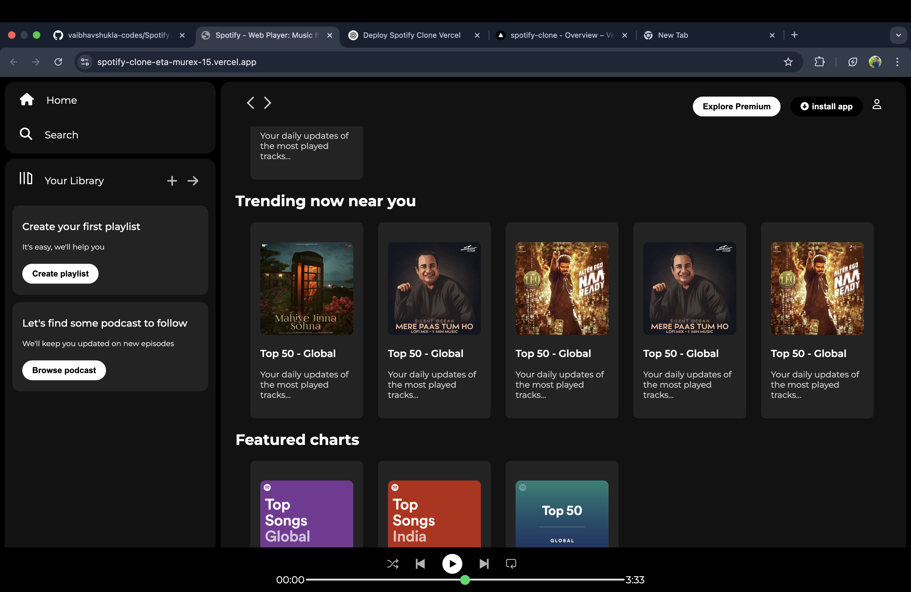

# 🎵 Spotify Clone

A visually appealing **Spotify Clone** built using **HTML**, **CSS**.
This project mimics the basic design of Spotify’s music player interface.

---

## 🚀 Live Demo

🔗 [View Live on Vercel](https://spotify-clone-vaibhavshukla.vercel.app/)

---

## 📸 Screenshots

---

## 🛠️ Tech Stack

- 🌐 HTML5
- 🎨 CSS3

---

## 🎯 Features

- 🎵 Audio playback controls (Play/Pause)
- ⏮️ Next and Previous track navigation
- 🧭 Responsive and clean UI
- 📃 Song list with metadata
- 📊 Progress bar sync with audio

---

